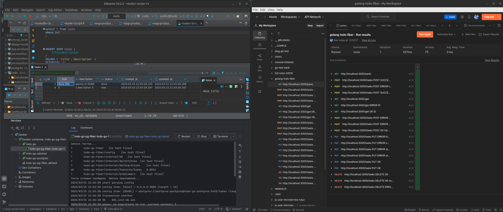

# Go Task App

Go Task App.
<br>
<br>
<b>Techies</b>: Golang, Fiber, Postgresql, Pgx, Goose, Docker.
<br>
<hr>

### How to start local:
```
make run
```
```
make stop
```
```
make reset
```

#### App listening ports by default:
1) backend:  3000.
2) postgresql: 6432/5432 (localhost/adminer).
3) adminer: 8081.

#### Accessing Adminer
To quickly connect to the PostgreSQL database, use Adminer:
1) ##### **URL**: [http://localhost:8081](http://localhost:8081)  
2) ##### **Database**: `db`  
3) ##### **User**: `postgres`  
4) ##### **Password**: `postgres`

#### Tests
1) Integrations (modules) use postman json `file`
2) Golang used for units `go test ./...`

#### DEMO
